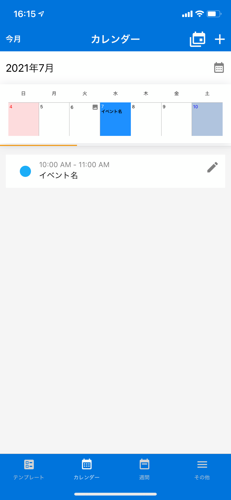

[トップに戻る](./index.md)

## 月カレンダー
***

> 月カレンダー形式で予定を表示し、選択された日付のレポート記録、予定、写真を表示します。

### 画面イメージ

### 画面項目説明

1. `今月ボタン`：ボタン押下で今月を表示します。
1. `カレンダー形式切り替えボタン`：ボタン押下で１ヶ月カレンダーと複数月カレンダーの形式を切り替えます。
1. `予定追加ボタン`：ボタン押下で選択している日付の予定を新規に作成します。
1. `写真有無アイコン`：該当の日付に撮影された写真がある場合、アイコンが表示されます。
1. `イベント名テキスト`：該当の日付のイベント件名が表示されます。
1. `タブバー`：画面下部でスワイプをすることで、「予定タブ」「レポートタブ」「写真タブ」を切り替えます。
    - `予定タブ`：カレンダーで選択された日付の予定が表示されます。
    - `レポートタブ`：カレンダーで選択された日付のレポートが表示されます。
    - `写真タブ`：カレンダーで選択された日付の写真が表示されます。
1. `レポート作成ボタン`：ボタン押下で選択された予定をもとにレポートを作成します。
1. `ポップアップ`：アプリ起動時にタブ切り替えの説明が表示されます。
1. `日付長押し`：日付を長押しすることで、一週間カレンダー形式の画面に切り替わります。

### 画面イメージ（バーティカルカレンダー）

### 画面イメージ（1週間カレンダー）

[トップに戻る](./index.md)