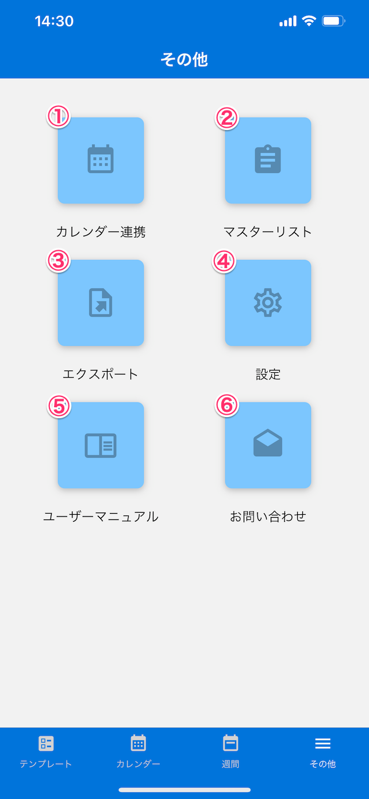

[トップに戻る](./index.md)

## その他

> カレンダー連携、エクスポートなど各種機能一覧をアイコン形式で表示します。

### 画面イメージ

### 画面項目説明

1. [`カレンダー連携`](./other/sync_calendar.md)：月・週カレンダーに表示するカレンダーを選択します。
1. [`マスターリスト`](./other/master_list.md)：営業報告で利用する「目的」、「結果」、「見込度」の項目を設定します。
1. [`エクスポート`](./other/export.md)：テンレート毎に登録された記録をCSV形式でエクスポートします。
1. [`お問い合わせ`](./other/contact_us.md)：選択されている日付を表します。
1. [`設定`](./settings/base.md)：該当の日付のイベント件名が表示されます。

[トップに戻る](./index.md)
