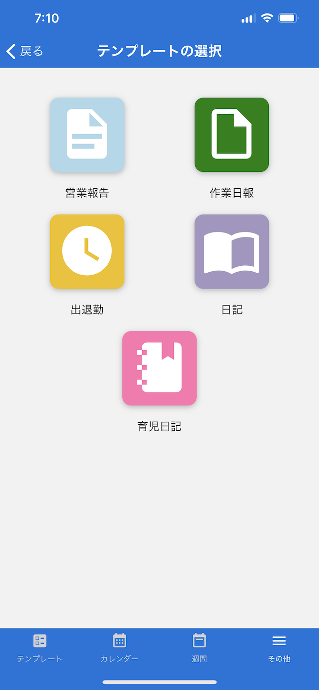
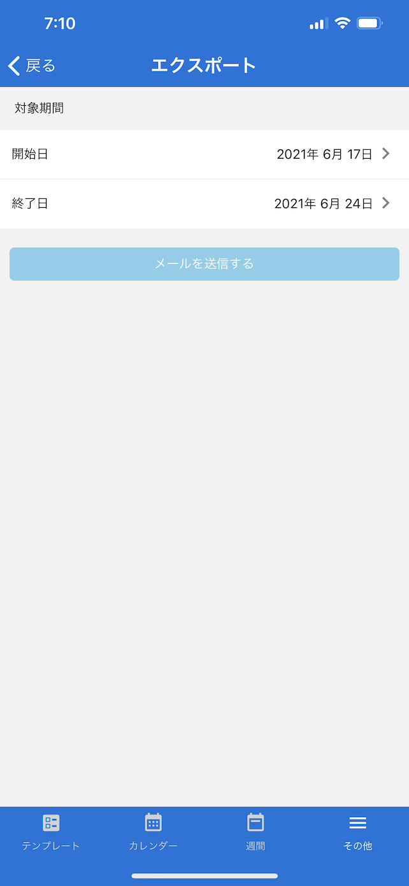

[その他に戻る](../other.md)

## エクスポート
***

> 記録した内容をCSV形式でメール送信します。

### 画面イメージ（エクスポートテンプレートの選択）

### 画面イメージ（エクスポート）

### 説明
- エクスポートするテンプレートを選択します。
- 出力する期間を選択し「メールを送信する」ボタンを押下すると、記録した内容がCSV形式でメールに添付されます。

[その他に戻る](../other.md)