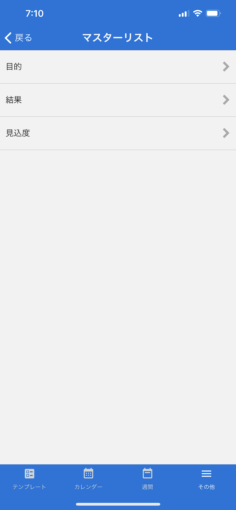
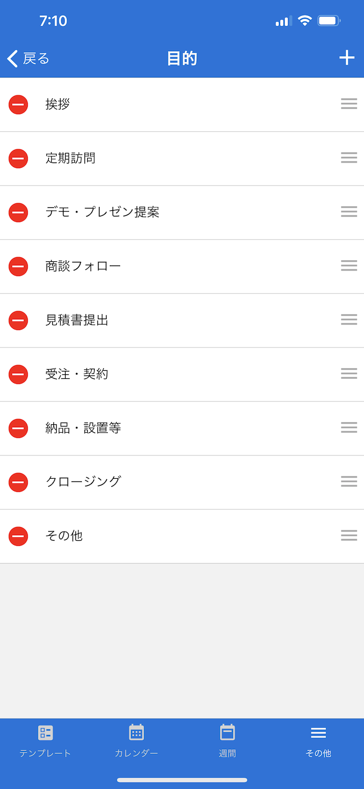
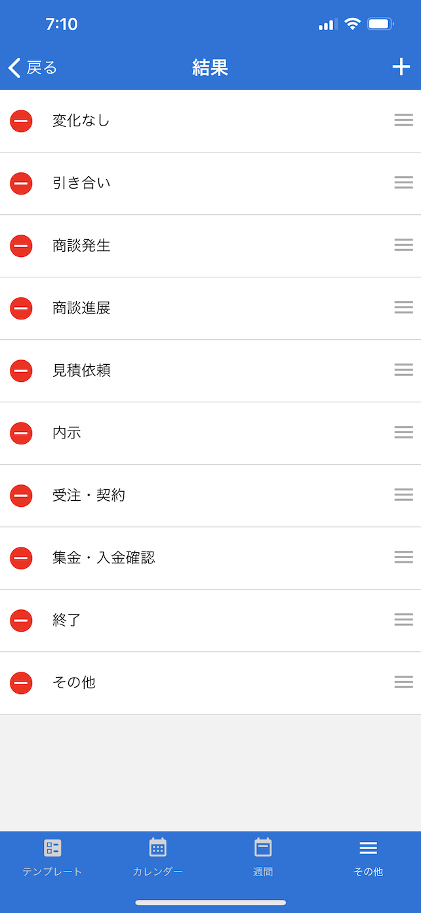
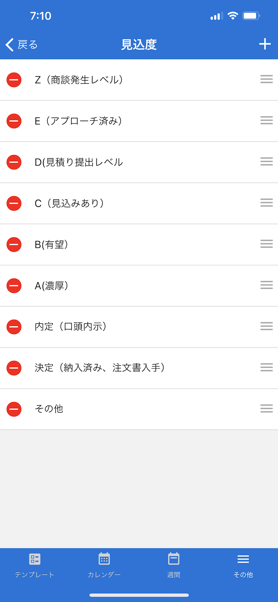

[その他に戻る](../other.md)

## マスターリスト
***

> 営業報告で利用する「目的」、「結果」、「見込度」の項目を設定します。

### 画面イメージ（マスターリスト）

### 画面イメージ（目的）

### 画面イメージ（結果）

### 画面イメージ（見込度）

### 説明
- [営業報告](../templates/sale_report.md)で選択する「目的」「結果」「見込度」のマスターを編集します。
- 画面右上の「＋」ボタンの押下で新規に項目の追加が可能です。
- 既存の項目を選択すると、名称を編集することができます。
- 不要な項目は、一覧の左にある削除ボタンをタップし削除します。

[その他に戻る](../other.md)