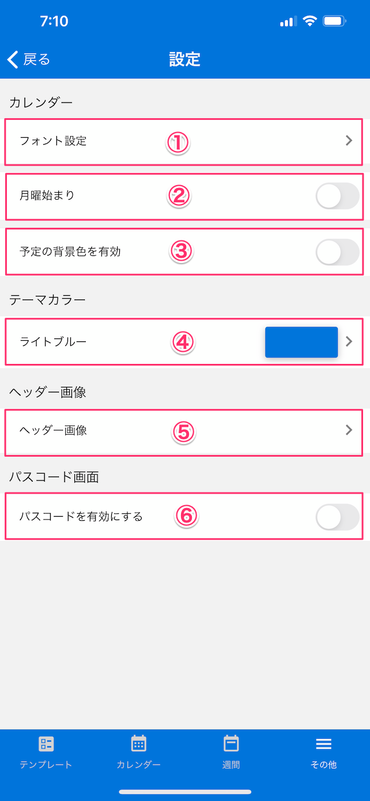

[その他に戻る](../other.md)

## 基本設定
***

> ヘッダー画像など各種基本情報の設定を行います。

### 画面イメージ

### 説明
- `フォント設定`：
- `月曜始まり`：
- `予定の背景色を有効`：
- `テーマカラー`：
- `ヘッダー画像`：
- `パスコード画面`：スケジュールレポアプリ起動時にパスコードによりロックする場合、「パスコードを有効にする」をONにします。

[その他に戻る](../other.md)