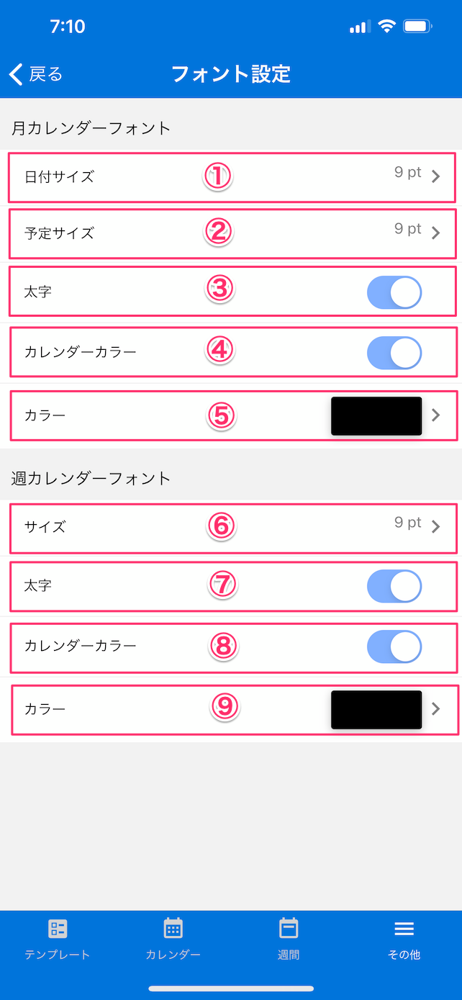
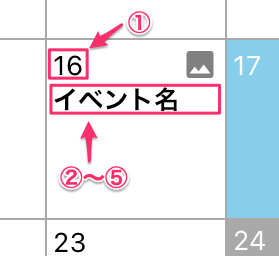

[設定に戻る](base.md)

## フォント設定
***

> カレンダーの日付、イベント文字列のフォントサイズ・カラーを設定します。

### 画面イメージ

### 画面イメージ（月カレンダー日付部分）

### 説明

1. `月カレンダー/日付サイズ`：月カレンダーの日付のフォントサイズを設定します。
1. `月カレンダー/予定サイズ`：月カレンダーに表示する予定件名テキストのフォントサイズを設定します。
1. `月カレンダー/太字`：月カレンダーに表示する予定件名テキストのフォントをボールドにする場合、設定をONにします。
1. `月カレンダー/カレンダーカラー`：月カレンダーに表示する予定件名テキストのカラーを任意に設定する場合、設定をONにします。
1. `月カレンダー/カラー`：月カレンダーの日付に表示する予定件名テキストのカラーを設定します。
1. `週カレンダー/サイズ`：週カレンダーに表示する予定件名テキストのフォントサイズを設定します。
1. `週カレンダー/太字`：週カレンダーに表示する予定件名テキストのフォントをボールドにする場合、設定をONにします。
1. `週カレンダー/カレンダーカラー`：週カレンダーに表示する予定件名テキストのカラーを任意に設定する場合、設定をONにします。
1. `週カレンダー/カラー`：週カレンダーに表示する予定件名テキストのカラーを設定します。

[設定に戻る](base.md)