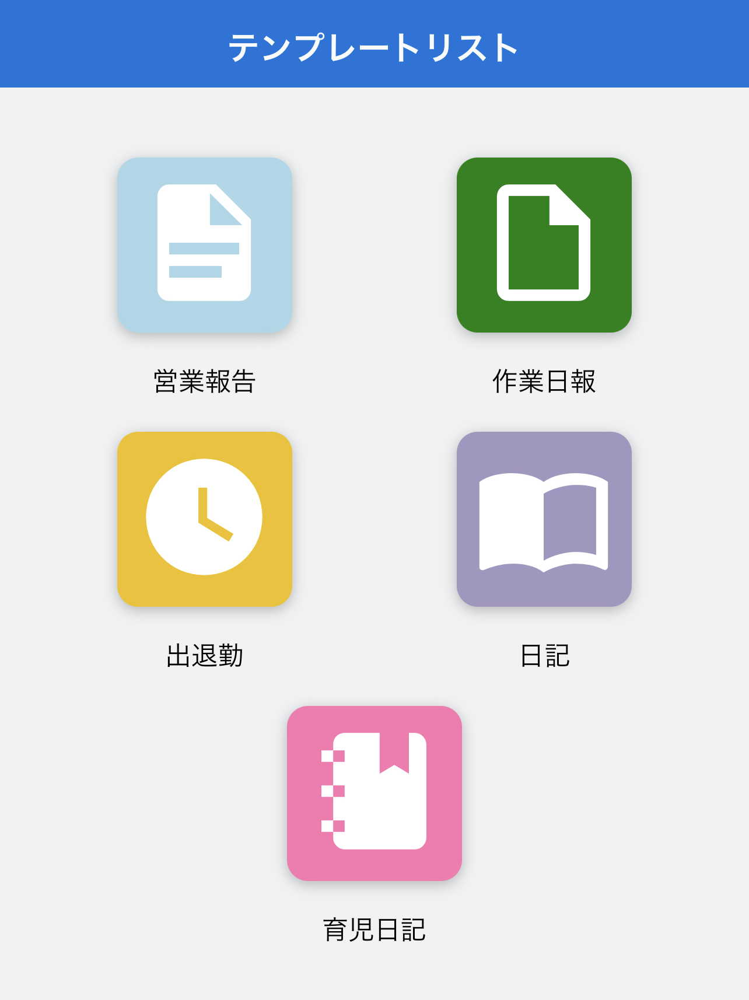

[トップに戻る](./index.md)

## テンプレート一覧
***

> 一覧から記録を行うテンプレートを選択します。

1. [営業報告](templates/sales_report.md)：営業の商談内容を簡単に記録できます。

1. [作業報告](templates/work_report.md)：日々の保守点検業務の内容が記録できます。

1. [出退勤](templates/attendance.md)：出退勤の日時を記録します。現場の出退勤などにご利用いただけます。

1. [日記](templates/diary.md)：写真と簡単なメモを日記形式で記録できます。

1. [育児日記](templates/baby_book.md)：お子様の日々の成長記録を手軽に記録することができます。

[トップに戻る](./index.md)