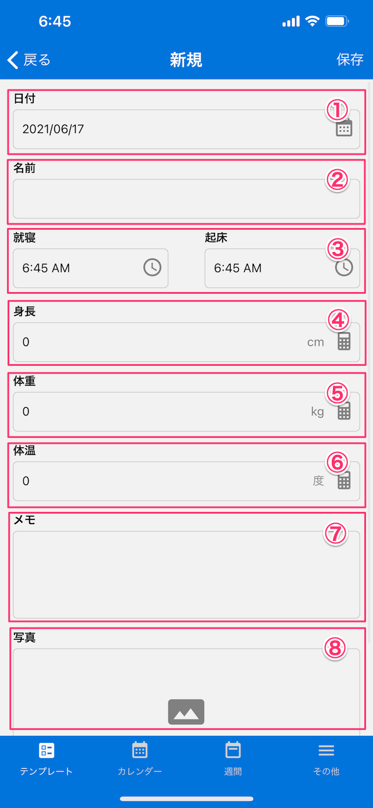

[テンプレート一覧に戻る](../templates.md)

## 育児日記
***

> お子様の日々の成長記録を手軽に記録することができます。

### 画面イメージ

### 入力項目
- `日付`：日付をカレンダーから選択します。
- `名前`：お子さんの名前を入力します。
- `就寝・起床`：就寝時間・起床時間を選択します。
- `身長`：身長を入力します。
- `体重`：体重を入力します。
- `体温`：体温を入力します。
- `メモ`：その日にあった出来事を入力します。
- `写真`：写真を撮影または選択します。

[テンプレート一覧に戻る](../templates.md)
