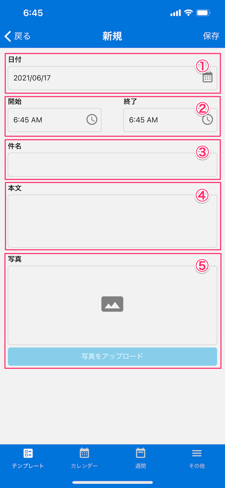

[テンプレート一覧に戻る](../templates.md)

## 日記
***

> 日記用テンプレートです。

### 画面イメージ

### 入力項目
- `日付`：日付をカレンダーから選択します。
- `開始・終了`：時間の情報を入力します。
- `件名`：日記のタイトルを入力します。
- `本文`：日記の本文を入力します。
- `写真`：写真を撮影または選択します。

[テンプレート一覧に戻る](../templates.md)
