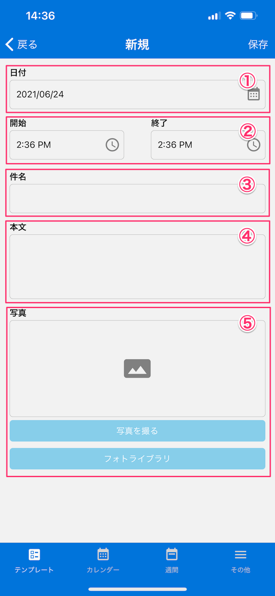

[テンプレート一覧に戻る](../templates.md)

## 日記
***

> 写真と簡単なメモを日記形式で記録できます。

### 画面イメージ

### 入力項目
- `日付`：日付をカレンダーから選択します。
- `開始・終了`：日記に記録する出来事の時間を入力します。
- `件名`：日記のタイトルを入力します。
- `本文`：日記の本文を入力します。
- `写真`：写真を撮影または選択します。

[テンプレート一覧に戻る](../templates.md)
