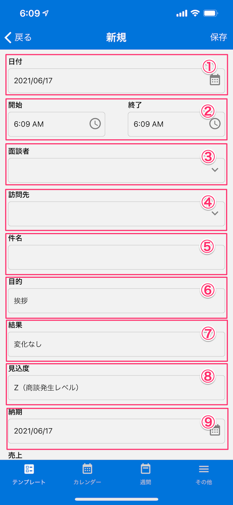
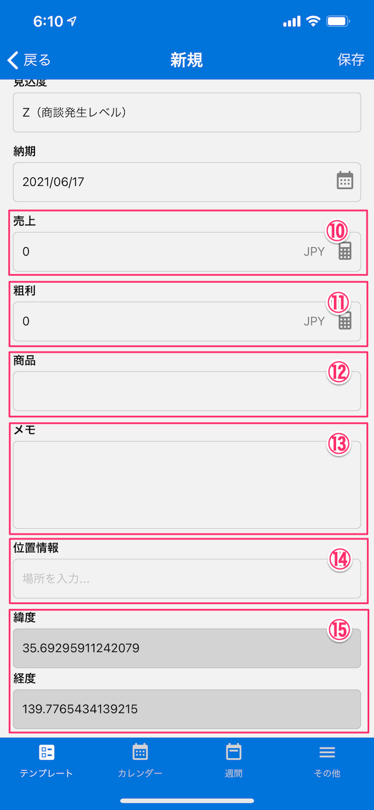

[テンプレート一覧に戻る](../templates.md)

## 営業報告
***

> 商談内容を記録するテンプレートです。

### 画面イメージ1

### 画面イメージ2

### 入力項目
- `日付`：商談日をカレンダーから選択します。
- `開始・終了時間`：商談の開始・終了時間を選択します。
- `面談者`：面談者をアドレス帳から検索または入力します。
- `訪問先`：訪問先をアドレス帳から検索または入力します。
- `件名`：商談の件名を入力します。
- `目的`：訪問目的を[マスターリスト](../other/master_list.md)から選択します。
- `結果`：商談結果を[マスターリスト](../other/master_list.md)から選択します。
- `見込度`：案件見込度を[マスターリスト](../other/master_list.md)から選択します。
- `納期`：商品の納期を入力します。
- `売上`：売上の金額を入力します。
- `粗利`：粗利の金額を入力します。
- `商品`：商品情報を入力します。
- `メモ`：商談に関するメモ情報を入力します。
- `位置情報`：訪問先の位置情報を入力します。
- `緯度・軽度`：現在地の緯度・経度が表示されます。

[テンプレート一覧に戻る](../templates.md)