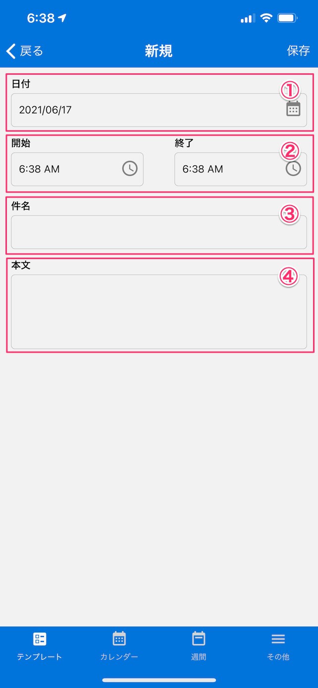

[テンプレート一覧に戻る](../templates.md)

## 作業日報
***

> 日々の保守点検業務の内容が記録できます。

### 画面イメージ

### 入力項目
- `日付`：作業日をカレンダーから選択します。
- `開始・終了時間`：作業の開始・終了時間を選択します。
- `件名`：作業の件名を入力します。
- `本文`：作業に関するメモ情報を入力します。

[テンプレート一覧に戻る](../templates.md)