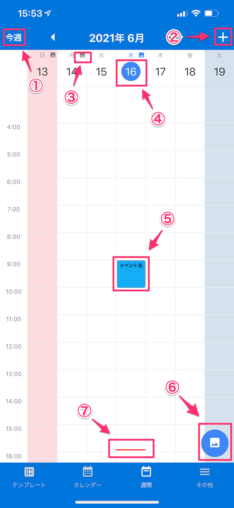

[トップに戻る](./index.md)

## 週カレンダー

> 週カレンダー形式で予定を表示し、選択された日付の予定、写真を表示します。

### 画面イメージ

### 画面項目説明

1. `今週ボタン`：ボタン押下で今週を表示します。
1. `予定追加ボタン`：ボタン押下で選択している日付の予定を新規に作成します。
1. `写真有無アイコン`：該当の日付に撮影された写真がある場合、アイコンが表示されます。
1. `選択日付`：選択されている日付を表します。
1. `イベント名テキスト`該当の日付のイベント件名が表示されます。
1. `写真一覧タブ`：選択された日付に写真がある場合に表示されます。ボタン押下で写真一覧を表示します。
1. `現在時刻ライン`：現在の日時の位置に表示されます。

[トップに戻る](./index.md)